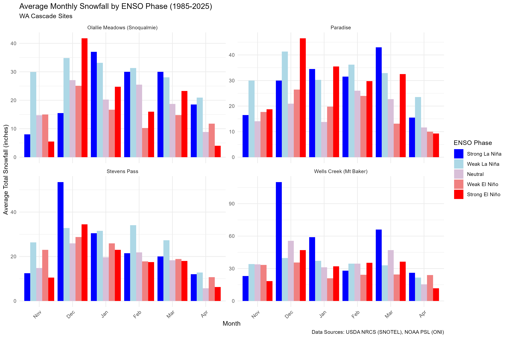
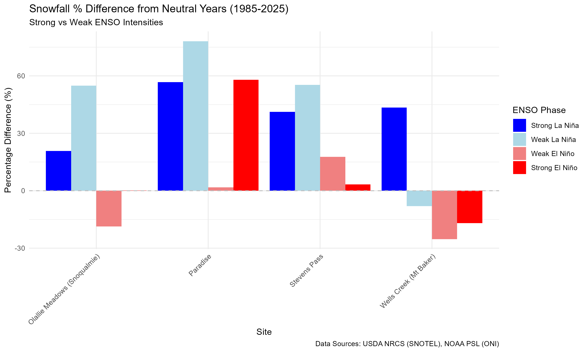

# WA Snowfall Analysis

## Overview

This analysis explores the relationship between ENSO (El Niño/La Niña) climate patterns and snowfall in the Washington Cascades. We analyzed data from 4 SNOTEL sites over the last ~40 years.

## Results

### Monthly Snowfall by ENSO Phase

This plot shows the average monthly snowfall (approximated from daily snow depth changes) for each site, categorized by ENSO phase.

#### Observations:

- La Niña years generally show higher snowfall across most sites and months.
- Strong La Niña often correlates with the highest snowfall peaks.
- El Niño years tend to have lower snowfall averages.

### Percentage Difference (Strong vs Weak)

This plot compares the percentage difference in annual snowfall for Strong/Weak ENSO phases relative to Neutral years.

#### Observations:

- Strong La Niña consistently shows a positive percentage difference (more snow than neutral).
- Strong El Niño consistently shows a negative percentage difference (less snow than neutral).
- The magnitude of the effect varies by site, with some sites showing more sensitivity than others.

## Methodology

### Data Sources:

- Snowfall: USDA NRCS SNOTEL (Stevens Pass, Olallie Meadows, Paradise, Wells Creek).
- ENSO: NOAA PSL Oceanic Niño Index (ONI).

### Processing:

- Snow Season defined as Nov-Apr.
- ENSO Phase classified using average ONI during the winter months (Nov-Mar).
- Snowfall approximated from daily snow depth increases.

---

See: [prompt.md](prompt.md) for the prompt used to generate this analysis in Antigravity using Gemini 3 Pro. No manual editing was done to the code. The README was made from the Walkthrough produced by Antigravity. Other than this paragraph, only minor formatting changes were made to the README.

